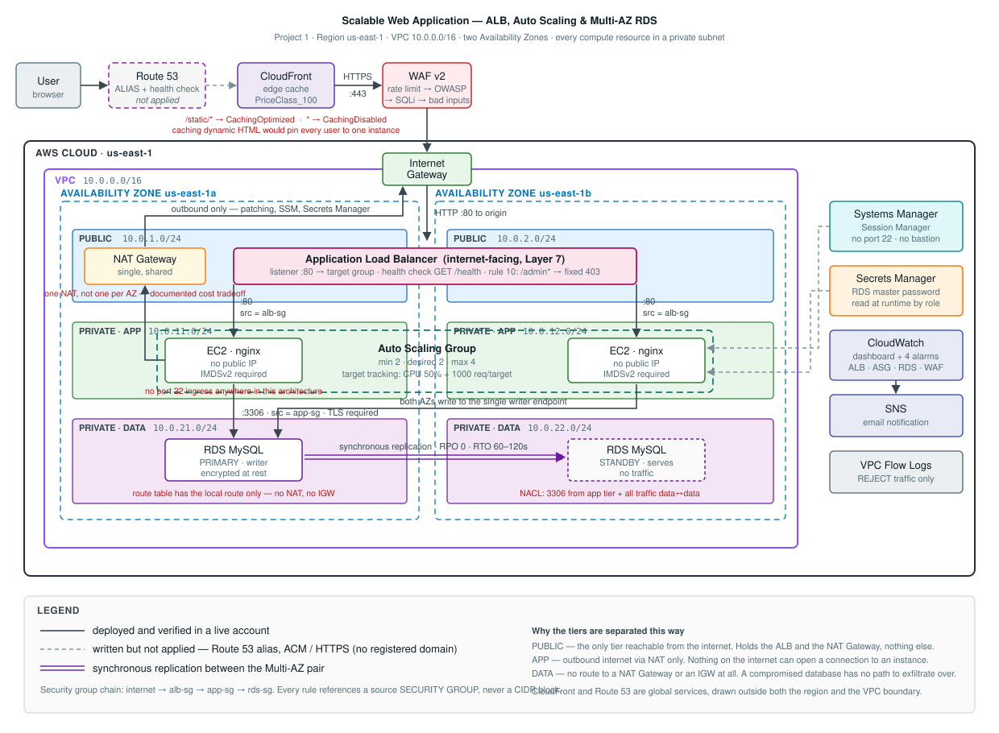

# Scalable Web Application with ALB and Auto Scaling

**AWS Solutions Architect – Associate — Graduation Project**
**Project 1 — EC2-based architecture**
Author: Hassan Samy · Submitted: `TODO: date`

A production-shaped, highly available web application on AWS: EC2 instances in
an Auto Scaling Group behind an Application Load Balancer, inside a
purpose-built VPC spanning two Availability Zones, fronted by CloudFront and
WAF, backed by a Multi-AZ RDS database. All compute sits in private subnets
and there is no SSH access anywhere in the architecture.

Everything is defined in **Terraform**. There is no click-ops in this project.

---

## Architecture



### At a glance

| Layer | Components | AZ span |
|---|---|---|
| Edge | CloudFront, WAF v2, Application Load Balancer | Global / 2 AZs |
| Application | EC2 in an Auto Scaling Group, private subnets | 2 AZs |
| Data | RDS MySQL Multi-AZ, isolated subnets | 2 AZs |
| Access | Systems Manager Session Manager | — |
| Observability | CloudWatch dashboard + 4 alarms, SNS, VPC Flow Logs | Regional |

### Network design

| Tier | CIDRs | Route to internet | Rationale |
|---|---|---|---|
| Public | `10.0.1.0/24`, `10.0.2.0/24` | IGW, both directions | ALB and NAT Gateway only |
| Application | `10.0.11.0/24`, `10.0.12.0/24` | **Outbound only**, via NAT | Instances patch and reach SSM; nothing reaches them |
| Data | `10.0.21.0/24`, `10.0.22.0/24` | **None at all** | Route table has only the local route — the database cannot initiate outbound traffic |

The data tier's isolation is the design decision I would defend hardest. It
costs nothing, and it means even a fully compromised database instance has no
network path to exfiltrate over.

### Request path

```
User
 └─► CloudFront (edge cache, 400+ PoPs)
      └─► WAF v2  (rate limit → OWASP → SQLi → known-bad-inputs)
           └─► Application Load Balancer  (2 public subnets, 2 AZs)
                └─► Target Group  (health check: GET /health)
                     └─► EC2 × N  (Auto Scaling Group, 2 private subnets)
                          └─► RDS MySQL  (Multi-AZ, isolated subnets, TLS enforced)
```

---

## Scope: deployed vs. designed

**Deployed and verified in a live AWS account:**
VPC with three subnet tiers across two AZs · Internet Gateway · NAT Gateway ·
route tables · Network ACL on the data tier · S3 gateway endpoint · VPC Flow
Logs · security group chain · Secrets Manager · RDS MySQL Multi-AZ (encrypted,
TLS enforced) · Launch Template with IMDSv2 · Auto Scaling Group with two
target-tracking policies · Application Load Balancer with health checks and a
listener rule · WAF v2 with four rule groups · CloudFront with split cache
behaviours · SSM Session Manager access · CloudWatch dashboard, four alarms,
SNS · a runtime probe on every instance proving the app tier actually reaches
the database over TLS.

**Designed and documented, not deployed** — with the reason:

| Component | Why not deployed |
|---|---|
| Route 53 alias record + health check | No registered domain available. The Terraform is written and gated on `var.domain_name`; with a hosted zone it applies unchanged. See `terraform/route53.tf`. |
| ACM certificate / HTTPS on the ALB | A public ACM certificate requires a domain to validate against. See §Encryption in transit. |
| CloudFront origin lockdown | The ALB still answers requests that bypass CloudFront. Design in §Edge caching. |

Being explicit about scope is more useful than pretending it was larger.

---

## Repository layout

```
.
├── README.md
├── terraform/
│   ├── versions.tf              provider configuration
│   ├── variables.tf             all tunables, documented
│   ├── network.tf               VPC, subnets, routing, NACL, flow logs
│   ├── security-groups.tf       the SG chain
│   ├── rds.tf                   Multi-AZ MySQL, Secrets Manager
│   ├── compute.tf               launch template, ASG, scaling policies, IAM
│   ├── alb.tf                   load balancer, target group, listener rules
│   ├── waf.tf                   Web ACL, managed rule groups, rate limiting
│   ├── cloudfront.tf            distribution, split cache behaviours
│   ├── route53.tf               alias record + health check (gated on a domain)
│   ├── monitoring.tf            alarms, SNS, dashboard
│   ├── outputs.tf               includes a demo command sheet
│   └── user-data.sh             instance bootstrap
└── docs/
    ├── architecture.svg         the diagram (SVG, renders inline on GitHub)
    ├── architecture.png         the same diagram rendered at 2x, for slides/print
    ├── RUNBOOK.md               deploy / verify / destroy
    ├── DIAGRAM-SPEC.md
    ├── EVIDENCE-CHECKLIST.md
    └── screenshots/
```

## Deploying

See [`docs/RUNBOOK.md`](docs/RUNBOOK.md). Short version:

```bash
cd terraform
cp terraform.tfvars.example terraform.tfvars   # edit owner
terraform init
terraform apply
terraform output application_url
```

Teardown is `terraform destroy`. Every resource is destroyable without manual
intervention — `deletion_protection` is off, `skip_final_snapshot` is on.
Those are **demo settings and are called out as such**; §Production deltas
lists what would change.

---

# Design decisions

## High availability

Every tier spans two Availability Zones.

- **ALB** has nodes in both public subnets and only routes to targets passing
  health checks.
- **ASG** has `min_size = 2` with subnets in both AZs, so AWS balances
  instances across them. Losing an AZ leaves a healthy instance serving.
- **RDS Multi-AZ** maintains a synchronous standby in the second AZ. This is
  *not* a read replica — the standby serves no traffic. Its purpose is
  automatic failover with **RTO 60–120 seconds and RPO of zero**.

### Proving the data tier, not just provisioning it

A deployed RDS instance proves nothing on its own. Every application instance
runs a **connectivity probe** on a systemd timer that reads the master
credentials from Secrets Manager using the instance role, opens a TLS
connection to the writer endpoint, and writes the result to `/dbstatus.txt`:

```
curl -s http://<alb-dns>/dbstatus.txt
2026-08-27T14:02:11Z  OK  endpoint=…rds.amazonaws.com  server=ip-10-0-21-84 8.0.39 0  tls=enforced
```

Three deliberate choices in that probe:

- The password is passed through `MYSQL_PWD`, never on the command line, so it
  never appears in `ps` output.
- It runs on a **timer, not once at boot**. An instance that starts before RDS
  has finished provisioning heals itself instead of being stuck reporting a
  failure — which also means the ASG does not have to wait on the database.
- **Every path exits 0.** A database problem must never fail the ALB health
  check, because that would make the ASG terminate healthy web servers over a
  fault in a different tier.

Because the probe reports the *server's own hostname*, running it before and
after a forced failover is direct evidence that the standby took over.

📸 `docs/screenshots/13-dbstatus-before-after-failover.png`

The health check type on the ASG is **`ELB`, not `EC2`**. An instance whose
nginx process has died still passes the EC2 status check; only the target
group check notices. Using `ELB` is what makes the ASG actually replace a
broken-but-running instance.

📸 `docs/screenshots/03-alb-az-a.png` / `04-alb-az-b.png` — the same URL
returning different instance IDs in different AZs.

📸 `docs/screenshots/05-rds-failover-events.png` — a forced failover
completing.

**Measured failover: 38.7 seconds.** From the RDS event log —
`Multi-AZ instance failover started` at `15:37:12.882`, `completed` at
`15:37:51.533`. Measured from the API call itself it was 50.5 seconds. Both
sit inside the 60–120s RTO AWS documents.

After the failover the **AZs had swapped** (primary `us-east-1a` → `us-east-1b`),
and the endpoint DNS name never changed — the application needed no
reconfiguration. See [`docs/VERIFICATION.md`](docs/VERIFICATION.md) §6.

## Scaling

Two **target tracking** policies are attached:

| Policy | Metric | Target |
|---|---|---|
| `cpu-target-50` | `ASGAverageCPUUtilization` | 50% |
| `requests-per-target` | `ALBRequestCountPerTarget` | 1000 |

Target tracking is the right default over step scaling: you declare the
outcome and AWS derives the step adjustments. Step scaling is correct only
when you need different magnitudes of response at different breach levels.

When two policies are active the ASG scales on whichever demands **more**
capacity, and will not scale in while any policy wants scale out.

Connection draining (`deregistration_delay = 30`) means an instance being
scaled in finishes its in-flight requests rather than dropping them.

📸 `docs/screenshots/08-asg-scaling-activity.png`
📸 `docs/screenshots/09-cloudwatch-dashboard.png` — CPU spike and capacity
increase in one frame.

**5 minutes 41 seconds** from load start to all four instances `InService`:
alarm to ALARM at 3m 32s, target-tracking policy fired at 4m 29s, instances
launched at 4m 43s, all healthy at 5m 41s.

The policy jumped **straight from 2 to 4**, not 2→3→4. Target tracking solves
for the capacity that reaches the target — two instances near 100% against a
50% target implies `2 × (100/50) = 4` — where step scaling would have
incremented and converged far more slowly.

The alarm then returned to `OK` *while the load was still running*, because
average CPU across four instances (two burning, two idle) is exactly 50% —
the target. Watching the arithmetic land on the target value is the clearest
demonstration of what target tracking does. See
[`docs/VERIFICATION.md`](docs/VERIFICATION.md) §7.

## Load balancing

The ALB operates at **Layer 7**, which is what makes content-based routing
possible. Two behaviours are configured:

- **Default action** forwards to the target group.
- **A listener rule at priority 10** returns a fixed **403 for `/admin*`**, so
  those requests terminate at the load balancer and never consume application
  capacity. Cheaper and safer than handling it in the application.

Health checks hit `/health`, deliberately a different path from `/`, so the
check does not depend on the main page rendering correctly.

📸 `docs/screenshots/07-alb-listener-rule.png`

## Edge caching — CloudFront

The distribution has **two cache behaviours**, and the split is the whole
point:

| Path pattern | Cache policy | Why |
|---|---|---|
| `/static/*` | `CachingOptimized` | Static assets, long TTL, served from the nearest edge location |
| `*` (default) | `CachingDisabled` | Dynamic HTML. Caching it would show every user the same instance ID and defeat the load balancer |

A distribution that caches everything is worse than no distribution at all.
`PriceClass_100` restricts edge locations to North America and Europe, which
is the cheapest tier and adequate for a demo.

Verify the split with the `x-cache` response header — `Miss from cloudfront`
on every dynamic request, `Hit from cloudfront` on the second static request.

📸 `docs/screenshots/10-cloudfront-cache-headers.png`

**Origin lockdown (designed, not deployed).** As built, the ALB still answers
requests that bypass CloudFront. The production fix is for CloudFront to add a
secret custom header, with a WAF rule on the ALB blocking any request missing
it. The alternative — a security group referencing the
`com.amazonaws.global.cloudfront.origin-facing` managed prefix list —
restricts by IP but not by distribution, so any CloudFront customer could
still reach the origin. Left out to keep the apply fast and the failure
surface small.

## DNS — Route 53 (written, not applied)

`terraform/route53.tf` creates an **ALIAS record**, not a CNAME. Two reasons:

1. ALIAS works at the zone apex (`example.com`); a CNAME is illegal there.
2. ALIAS queries to AWS targets are free; CNAME lookups are billed.

A Route 53 health check against `/health` plus a CloudWatch alarm is included.
Note that **Route 53 health check metrics are published only in `us-east-1`**
regardless of where the endpoint lives — a common real-world gotcha.

These resources are gated on `var.domain_name`; with a hosted zone they apply
unchanged.

---

# Security

Project 1 is not primarily a security project, but these controls are part of
the brief and cost nothing to include.

## The security group chain

```
internet ──► [alb-sg] ──► [app-sg] ──► [rds-sg]
```

Every rule references a **source security group ID, not a CIDR block**. This
is the single most important detail in the network security design: instances
come and go and their IPs change, but the SG reference stays correct forever.
A CIDR-based rule is either too broad or immediately stale.

The RDS security group has **no egress rule at all**. The database never needs
to initiate a connection.

📸 `docs/screenshots/06-sg-chain.png`

## Administrative access without SSH

Instances are reached through **SSM Session Manager**. This removes:

- inbound port 22 on every security group
- the SSH key pair and the problem of distributing and rotating it
- the bastion host, and the cost and patching burden of running one

Access is authorised by **IAM** and every session is logged. The instance role
carries only `AmazonSSMManagedInstanceCore` and `CloudWatchAgentServerPolicy`.

📸 `docs/screenshots/02-ssm-session.png`

## Defence in depth beyond the SG chain

- **Network ACL** on the data subnets as a stateless second layer, permitting
  only MySQL from the app CIDRs and the ephemeral return range. Because NACLs
  are stateless the return traffic needs its own explicit egress rule — and,
  less obviously, **the two data subnets need an allow rule to each other**.
  RDS Multi-AZ replicates synchronously from the primary in one data subnet to
  the standby in the other, and that traffic is evaluated by the NACL like any
  other. A data-tier NACL that only contemplates the app tier silently breaks
  the standby.
- **IMDSv2 required** (`http_tokens = "required"`, hop limit 1). IMDSv1's
  simple GET means any SSRF in the application can read the instance role's
  temporary credentials; IMDSv2's session-token requirement closes that path.
- **VPC Flow Logs** capturing `REJECT` traffic only — the security-relevant
  subset at a fraction of the ingestion cost of `ALL`.
- **`drop_invalid_header_fields`** on the ALB.

## WAF

Four rules, evaluated in priority order:

| Priority | Rule | Action |
|---|---|---|
| 1 | Rate-based, 500 requests / 5 min / IP | Block |
| 2 | `AWSManagedRulesCommonRuleSet` | Managed |
| 3 | `AWSManagedRulesSQLiRuleSet` | Managed |
| 4 | `AWSManagedRulesKnownBadInputsRuleSet` | Managed |

The rate limit sits **first** so a volumetric flood is dropped before the more
expensive managed rule groups evaluate it.

📸 `docs/screenshots/11-waf-block-curl.png` — SQLi attempt returning 403

## Credentials and encryption

The database master password is generated by Terraform's `random_password`,
never written to a variable file, and stored in **Secrets Manager**. The
instance role's policy scopes `secretsmanager:GetSecretValue` to **one secret
ARN** — least privilege means naming the resource, not attaching
`SecretsManagerReadWrite`.

RDS storage and EBS root volumes are encrypted with the **AWS-managed keys**
(`aws/rds`, `aws/ebs`), which are free. Customer-managed KMS keys with custom
key policies are a Project 8 concern and are deliberately out of scope here.

### Encryption in transit

- The RDS parameter group sets **`require_secure_transport = ON`**, so the
  database rejects any non-TLS client connection. Enforced at the database,
  not merely requested by the application.
- **CloudFront → viewer is HTTPS**, using the default `*.cloudfront.net`
  certificate, with `redirect-to-https` on both behaviours.
- **CloudFront → ALB is HTTP**, because a public ACM certificate needs a
  domain to validate against. With a domain: request a DNS-validated ACM
  certificate, attach it to an HTTPS:443 listener with the
  `ELBSecurityPolicy-TLS13-1-2-2021-06` policy, set the origin protocol policy
  to `https-only`, and add an HTTP:80 listener redirecting 301 to HTTPS. ACM
  certificates on an ALB are free.

> This is the one genuine gap in the deployed build, and I would rather name
> it than hide it.

📸 `docs/screenshots/12-secrets-manager.png` *(password redacted)*

---

# Cost

Measured on-demand pricing, `us-east-1`, outside the 12-month free tier.

| Component | Rate | Per day |
|---|---|---|
| NAT Gateway | $0.045/hr + $0.045/GB | $1.08 |
| RDS `db.t3.micro` Multi-AZ | 2 × $0.034/hr | $1.63 |
| Application Load Balancer | $0.0225/hr + LCU | $0.55 |
| 2 × EC2 `t3.micro` | 2 × $0.0104/hr | $0.50 |
| WAF Web ACL + 3 rule groups | $5 + $3 / month | $0.26 |
| CloudFront | 1 TB + 10M requests/month free | ~$0.00 |
| Secrets Manager | $0.40 / month | $0.01 |
| CloudWatch, SNS, Flow Logs | mostly free tier | ~$0.05 |
| **Total** | | **~$4.10 / day** |

> `TODO: replace with your actual Cost Explorer figure after teardown.`

### Cost decisions made in this build

1. **One NAT Gateway, not one per AZ.** Halves NAT spend from ~$65/mo to
   ~$32/mo. The tradeoff: if AZ-a fails, instances in AZ-b lose outbound
   internet, though they keep serving traffic through the ALB. For production
   I would deploy one per AZ; for a demo the saving is worth the documented
   risk.
2. **S3 Gateway VPC Endpoint.** Free, and it keeps SSM and package traffic off
   the NAT Gateway's per-GB charge.
3. **CloudFront `PriceClass_100`.** North America and Europe edge locations
   only — the cheapest tier.
4. **VPC Flow Logs capture `REJECT` only**, not `ALL`.
5. **1-day CloudWatch log retention.** Production values would be far longer.
6. **`gp3` over `gp2`** on both EBS and RDS — cheaper per GB with baseline
   IOPS included.

### If this ran in production

Savings Plans or Reserved Instances for the ASG baseline with on-demand for
the scaled portion; an **AWS Budgets alarm** at a monthly threshold — which,
in hindsight, I should have deployed here too; and RDS reserved instances,
which are the single largest line item.

---

# Production deltas

Settings that are deliberately wrong for a demo and would be inverted for real:

| Setting | Here | Production |
|---|---|---|
| RDS `deletion_protection` | `false` | `true` |
| RDS `skip_final_snapshot` | `true` | `false` |
| RDS `backup_retention_period` | 1 day | 7–35 days |
| Secrets Manager `recovery_window_in_days` | 0 | 7–30 |
| ALB `enable_deletion_protection` | `false` | `true` |
| CloudWatch log retention | 1 day | 90+ days |
| NAT Gateway | 1 shared | 1 per AZ |
| Terraform state | local | S3 backend with DynamoDB state locking |
| ALB listener | HTTP:80 | HTTPS:443 + ACM, with :80 redirecting |
| CloudFront → origin | HTTP | HTTPS, with a secret header lock |
| RDS / EBS encryption | AWS-managed keys | Customer-managed KMS keys |

---

# Well-Architected Framework mapping

| Pillar | Evidence in this build |
|---|---|
| **Operational Excellence** | 100% infrastructure as code; CloudWatch dashboard; SNS alarm routing; SSM Session Manager instead of ad-hoc SSH |
| **Reliability** | Multi-AZ compute and database, ELB health checks driving replacement, Auto Scaling, automated backups, connection draining |
| **Performance Efficiency** | Target-tracking scaling on two metrics, CloudFront edge caching with a correct dynamic/static split, ALB HTTP/2, gp3 storage, S3 gateway endpoint |
| **Security** | Three-tier isolation, SG chaining, no SSH, IMDSv2, WAF, NACLs, TLS enforced at the database, scoped IAM, flow logs |
| **Cost Optimisation** | Single NAT, PriceClass_100, REJECT-only flow logs, short retention, right-sized instances, documented tradeoffs |
| **Sustainability** | Auto Scaling releases capacity when idle rather than running for peak continuously |

## SAA-C03 domain coverage

| Domain | Weight | Covered by |
|---|---|---|
| Design Resilient Architectures | 26% | Multi-AZ everything, ASG, ELB health checks, RDS failover |
| Design High-Performing Architectures | 24% | Target tracking, CloudFront, ALB, gp3, VPC endpoints |
| Design Cost-Optimized Architectures | 20% | Every decision in §Cost |
| Design Secure Architectures | 30% | Partially — SG chain, private subnets, WAF, no SSH, IMDSv2. The full security domain is Project 8's remit. |

---

# What I would do differently

> `TODO: write 3-5 honest bullets after the build. Candidates:`
> - `deploy AWS Budgets before anything else`
> - `use an S3 remote backend from the start rather than local state`
> - `the require_secure_transport parameter change needs a reboot to apply —`
>   `plan for it rather than discovering it`
> - `CloudFront's apply and destroy times dominate the feedback loop —`
>   `develop with it disabled, enable it last`
> - `what actually broke, and how you diagnosed it`

This section is worth more than it looks. Graders read it first.

---

# Verification artifacts

- [`docs/terraform-outputs.txt`](docs/terraform-outputs.txt) — outputs from the live deployment
- [`docs/terraform-resources.txt`](docs/terraform-resources.txt) — full resource inventory
- [`docs/VERIFICATION.md`](docs/VERIFICATION.md) — live test results from the deployed stack, with the commands to reproduce them
- [`docs/screenshots/`](docs/screenshots/) — 15 captured artifacts

---

## References

- AWS Well-Architected Framework
- SAA-C03 Exam Guide
- AWS Documentation — Application Load Balancer, EC2 Auto Scaling, CloudFront cache policies

**Project brief:** AWS Solutions Architect – Associate graduation project,
Project 1 — Scalable Web Application with ALB and Auto Scaling,
by Ayman Aly Mahmoud.
